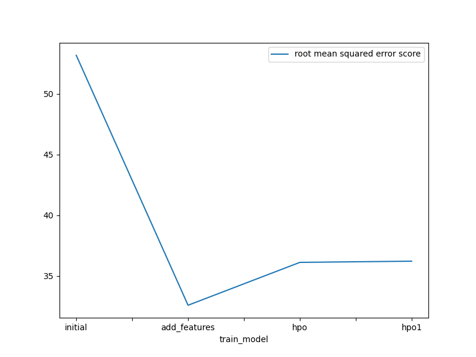
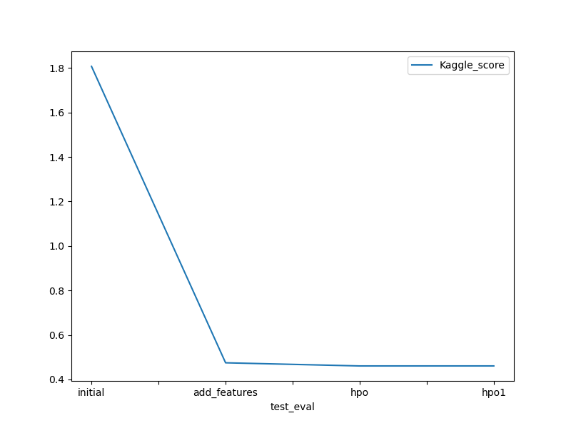

# Report: Predict Bike Sharing Demand with AutoGluon Solution
#### Harlem Arol RAKOTONANDRASANA

## Initial Training
### What did you realize when you tried to submit your predictions? What changes were needed to the output of the predictor to submit your results?
When I try to submit my prediction, I realize the score is high. I need to change the format of the features like the date and some categorical value that consider as integer.

### What was the top ranked model that performed?
My top rank model has a score of 0.47003

## Exploratory data analysis and feature creation
### What did the exploratory analysis find and how did you add additional features?
Exploratory analysis find some feature make confusing. The additional features give the predictor more information and more accuracy.

### How much better did your model preform after adding additional features and why do you think that is?
My model after adding features perform well as the score is improved. I think that sparing the date will give more indication that correlate to the result.

## Hyper parameter tuning
### How much better did your model preform after trying different hyper parameters?
After trying different hyper parameters, the score was improved. 

### If you were given more time with this dataset, where do you think you would spend more time?
If I given more time with this dataset, I think I would spend more time on features engineering

### Create a table with the models you ran, the hyperparameters modified, and the kaggle score.
|model|hpo1|hpo2|hpo3|score|
|--|--|--|--|--|
|initial|Default|Default|Persets: Best quality|1.79833|
|add_features|Dates parsing|Feature Engineering|Persets: Best quality|0.48965|
|hpo|GBM, KNN, XGB|Optimize Hyperparameter|Bagging, Stack|0.47003|

### Create a line plot showing the top model score for the three (or more) training runs during the project.

TODO: Replace the image below with your own-.

### Create a line plot showing the top kaggle score for the three (or more) prediction submissions during the project.

TODO: Replace the image below with your own.

## Summary
I get my best model on the hyperparameter optimization methode
